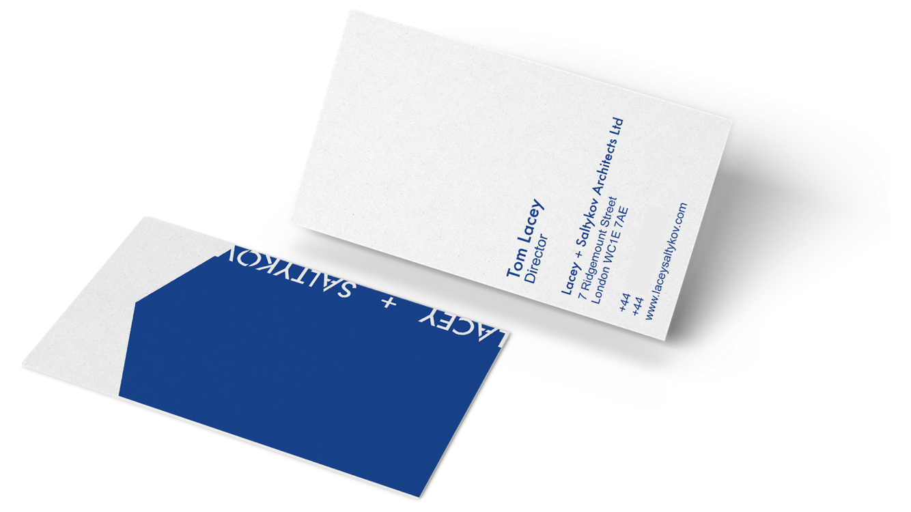
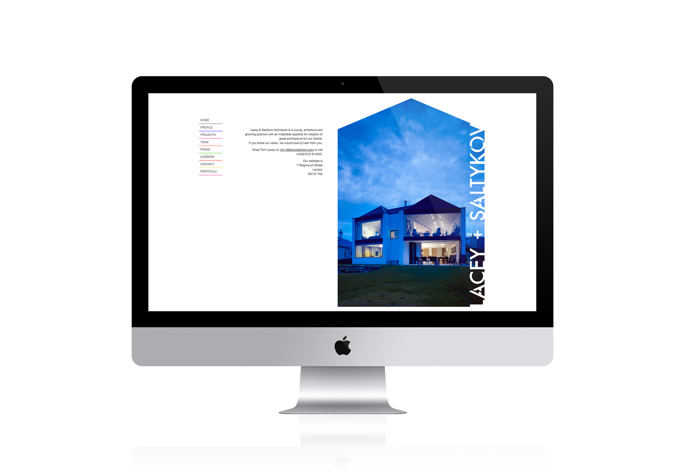

Whilst at [WeCreateDigital](https://wecreatedigital.co.uk/) I refreshed the branding and redesigned the print and website of London Architects [Lacey + Saltykov](http://laceysaltykov.com/). The updated branding and website worked to complement previous project publications. A branding guidelines document was created to ensure all team members were consistent when publishing internal and external documents. The clients website, stationery and publications were updated to reflect the new branding guidelines.

<figure>
  
  <figcaption>
   Lacey + Saltykov Business Card design.
  </figcaption>
</figure>
<figure>
  
  <figcaption>
   Lacey + Saltykov Website design.
  </figcaption>
</figure>

