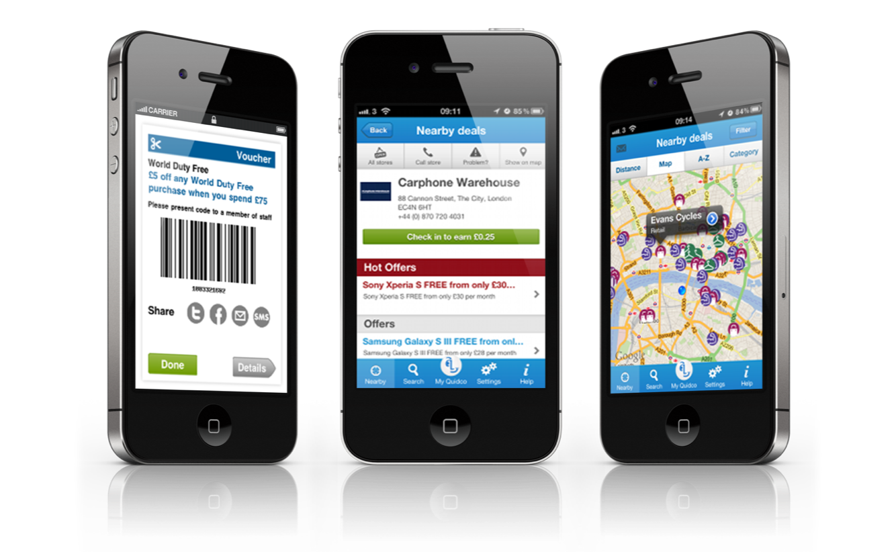
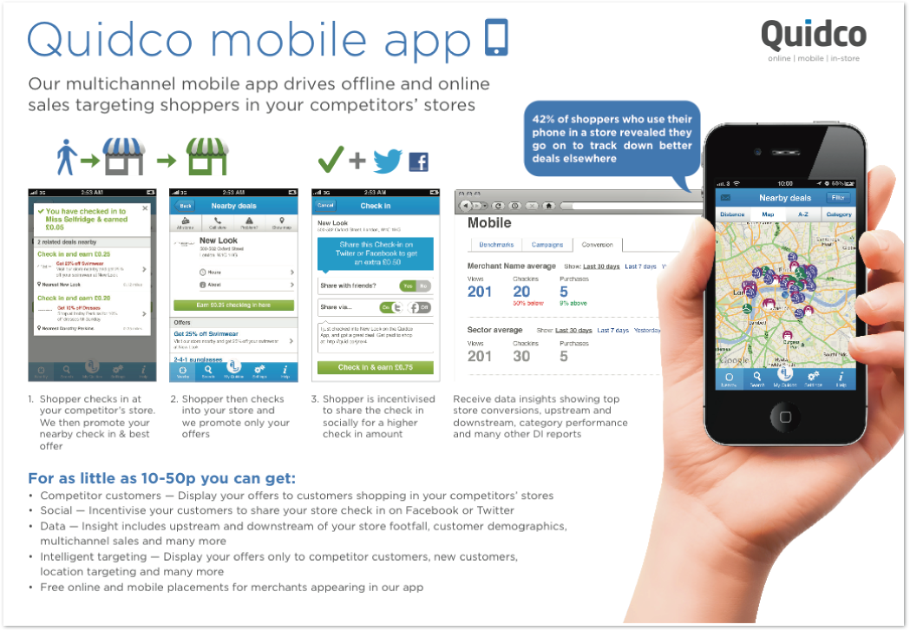
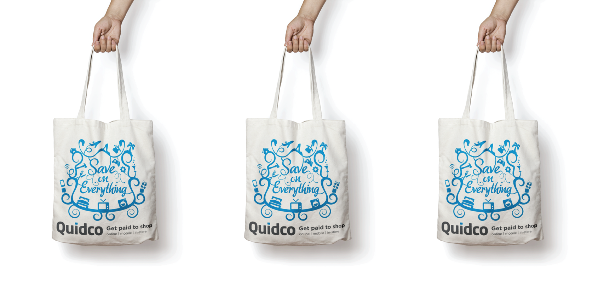
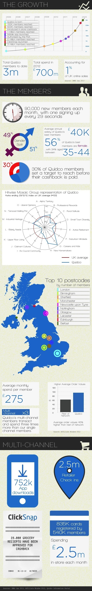

During my time as a Digital Designer with [Quidco.com](https://quidco.com), I assisted the Head of Design in designing panels for the Quidco.com app. The app, which was used by a large number of the 3 million Quidco.com members was continually updated to include new features. The Quidco.com app was featured on Econsultancy.com as an ['example of mobile marketing excellence'](https://econsultancy.com/blog/62128-six-examples-of-mobile-marketing-excellence/).

<figure>
  
  <figcaption>
   An example of marketing collateral which was designed to promote the app to retailers and interested parties.
  </figcaption>
</figure>

<figure>
  
  <figcaption>
   A design concept to be screen-printed onto tote bags for an upcoming promotional event.
  </figcaption>
</figure>

<figure>
  
  <figcaption>
   An infographic created to celebrate Quidco reaching 3 million members. It was distributed to show the growth of the company since 2005.
  </figcaption>
</figure>

