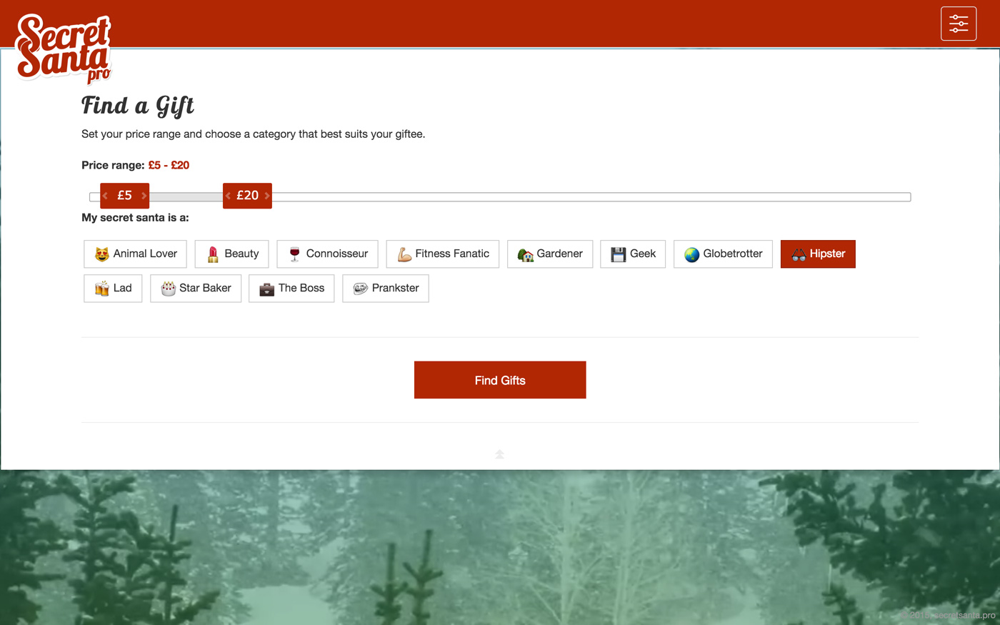
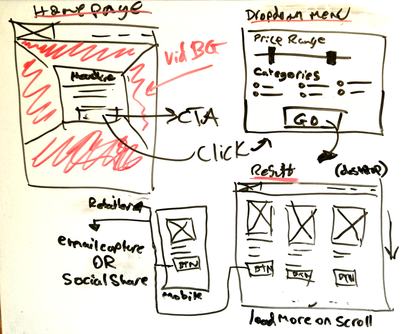
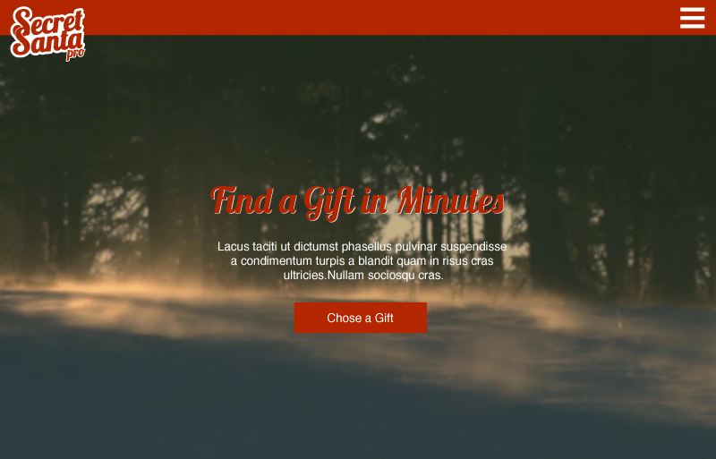
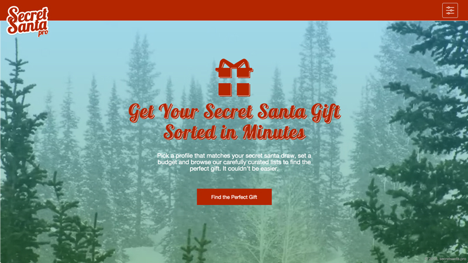

SecretSanta.pro was a reactive project created to help avoid the hassle of finding a secret Santa gift that's both suitable and within budget.

### RAPID CONCEPTUALISATION

The challenge was to design, build and launch a Christmas related offering within a week. I chose to outline the idea and various states on a whiteboard to help speed up the initial decision making process. Once happy with the general outline, the next step was to create a mock-up.

### MOCKING UP

Adobe Illustrator was used to design the mock-up, which provided an idea of the colour scheme and typefaces that would suit the final build.

### THE BUILD

Since the build would use many components from the Bootstrap framework, it was faster to build the design and make any small alterations in code. The build, including alterations, took two days to complete, after which the website was ready to be populated with gifts.

### POPULATING THE SITE

I developed a back-end page to speed up the process of categorising and error checking gifts as they were imported into the database. Each territory had a separate gift product pool to reflect audiences in the US, Canada and the UK. In total, secretsanta.pro was populated with approximately 3,000 curated gifts.
