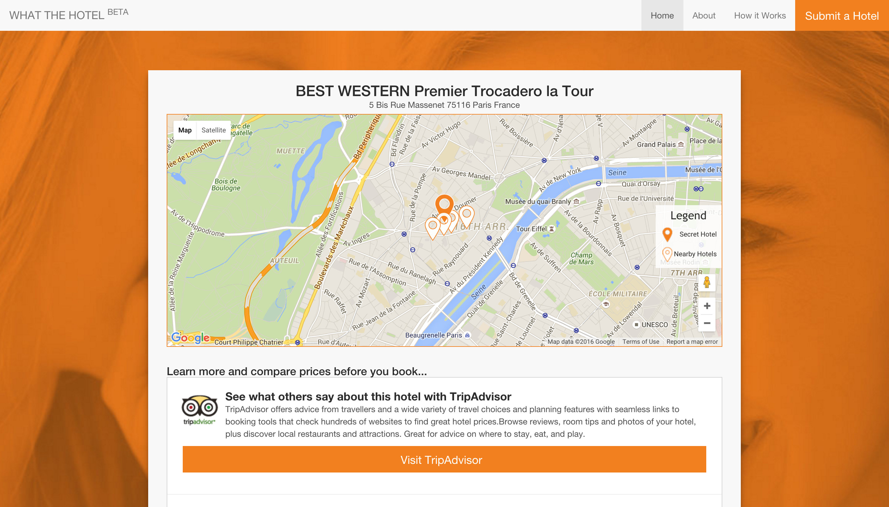

Whatthehotel.com is a project I co-created out of curiosity for wanting to know the true identities of Lastminute.com "top secret hotels" before I booked. I initially came up with the idea and was responsible for the reverse-engineering, design and front-end development of the tool. I discovered many guides and forums online where groups of people were attempting to uncover secret hotels manually and sharing their results. It was a fun project to see if it would be possible to devise and build an automated process.

### Needle in a Haystack

There is always a challenge associated with programmatically solving a problem. In order for the tool to be successful, it was important to develop a procedure that would work for the largest number of cases. This involved a process of understanding the data available and how it could be manipulated to provide 'clues' that would help to pinpoint the location of the accommodation. Since the problem included hotels from around the world, the initial steps were akin to searching for a needle in a haystack.

### Sherlock Holmes'ing the Data

Due to the vast number of hotels in the world, it made sense to first segment the information based on country and region. To make the data more manageable, additional logic was applied that would match attributes which the hotel possessed. This would continually compare attributes and omit any hotels which weren't a 'like-for-like' match. This process of elimination would slowly pare this data to remove the majority of hotels from the initial data-set until a unique hotel resulted.

### Finding the Needle Faster

Although the process of elimination used above was fairly quick at finding a match, further improvements could be made. After some tests it became apparent that certain properties of a hotel were less common, outputting a drastically reduced result-set. These were prioritised in the paring process, thus decreasing the time it took to find a result.

### Design Considerations

When designing the website I chose to remove any obstacles that would obfuscate the hotel submission procedure. Although a result could be generated in a matter of seconds, some took longer to process. I knew that for many users, waiting any amount of time would be a negative experience. Having a result sent to their email address would provide me with enough time to process the result and prevent the user from waiting. This would also ensure that the website would not be open to abuse. I was initially considering that users would be required to sign up to use the tool, however, I felt that the low frequency at which any member would use the service would render a sign-up process counterintuitive.

I designed and coded an alert email to notify users when their result was completed. This email directed users to a custom results (top of post) page where they could view their result and learn more about their hotel with additional links to review sites and services where they could compare prices.

### Launching Whatthehotel.com

The website was launched and was quickly picked up by [The Next Web](https://thenextweb.com/apps/2015/09/16/hotel-discount-pi/) and [Lifehacker](http://www.lifehacker.co.uk/2015/09/16/whatthehotel-reveals-secret-hotels-before-you-actually-book-them) who described it as “travel hacking magic”.

UPDATE: The website has been retired due to continual circumvention updates to lastminute.com.
