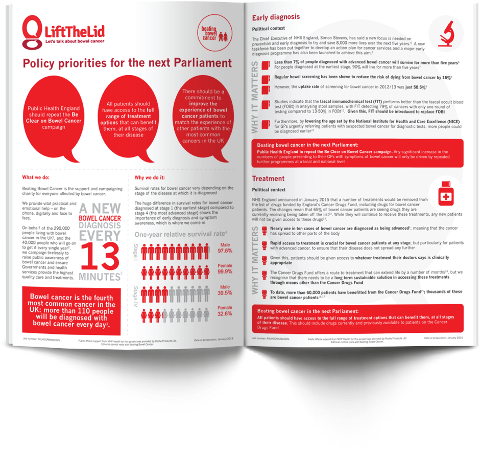

<figure>
  
  <figcaption>
   Whilst at [WeCreateDigital](https://wecreatedigital.co.uk/) I designed an infographic rich newsletter for [Beating Bowel Cancer](https://www.beatingbowelcancer.org/). My client requested that the design was to complement current branding and communicate data and complex information creatively.
  </figcaption>
</figure>

