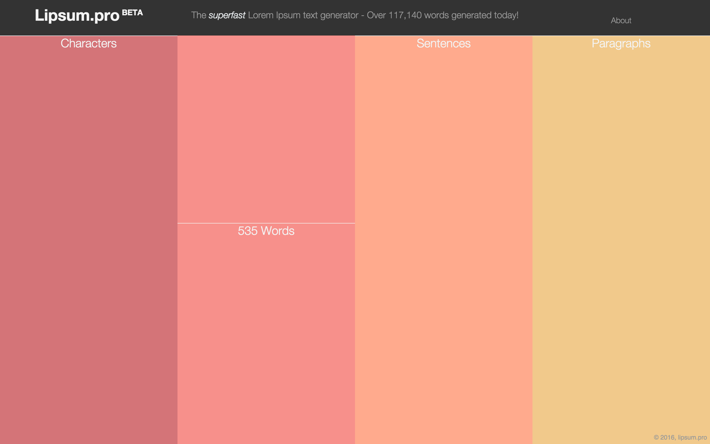
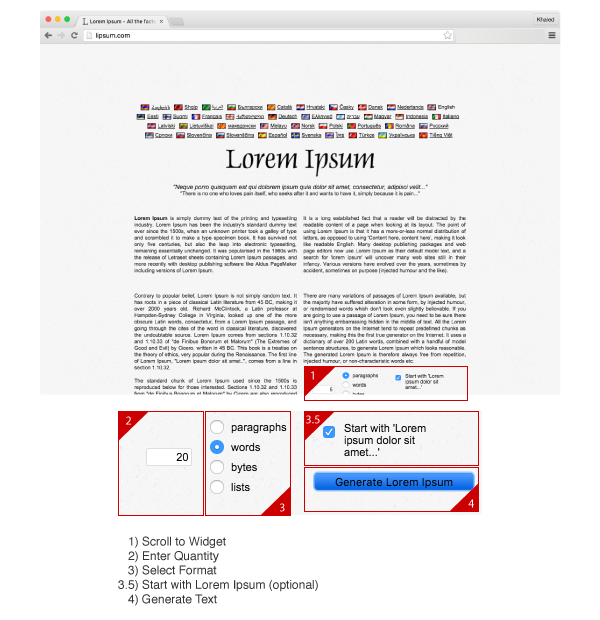
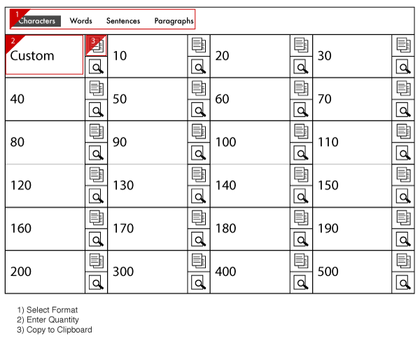
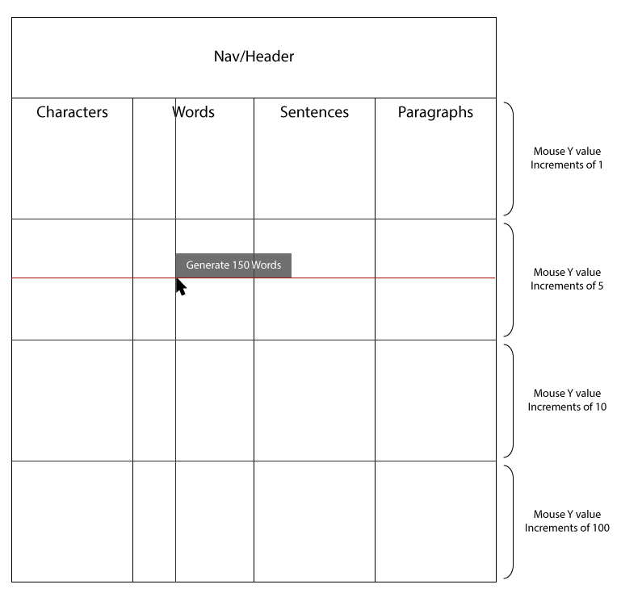
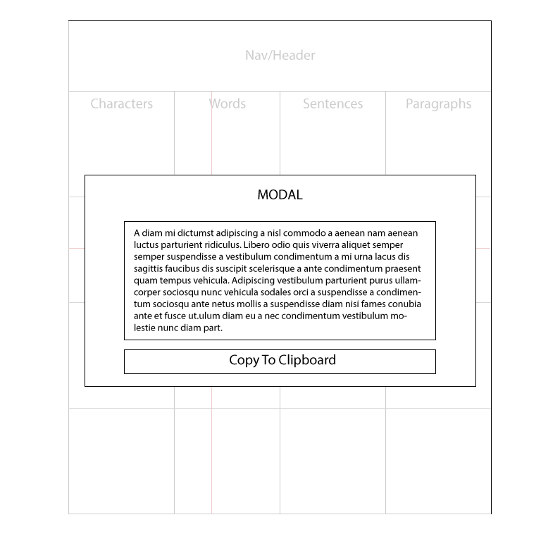

[Lipsum.pro](http://lipsum.pro) was created as an improved alternative to the popular random text generator, [Lipsum.com](http://lipsum.com). When using Lipsum.com for previous projects I had encountered a number of unnecessary steps which delayed the process of generating text.

### Lipsum.com in Steps

A request using Lipsum.com would require a minimum of 4-5 user actions which alternate between use of the keyboard and mouse. The solution for Lipsum.pro would need to simplify the process into the least amount of steps as possible and avoid alternating between input devices.

### Lipsum.pro Initial Concept

The initial concept would bring content to the top of the page to eliminate scrolling. Users could select their format and then enter a custom value or one-click copy-to-clipboard a pre-defined quantity of text. The concept appeared crowded with many repeating buttons and no clear direction for the user. The predefined buttons lacked precision and users would be required to use the custom option which would require the use of the keyboard.

The next iteration would need to address the issue of overcrowding and provide greater precision, without the use of a keyboard.

### Lipsum.pro Refined Concept Wireframes

The concept was refined to utilise the x and y values of the mouse cursor. The x-value would dictate which format the user requires, whilst the y-value would determine the quantity. A cursor tool-tip would display the format and value and update as the cursor moves. Clicking the left mouse button would generate the text, which would display in a modal.

The modal displays the generated text in a text box. A button would act as a one-click copy-to-clipboard and the text in the text box would be directly copyable in case of compatibility issues with the copy to clipboard functionality.

The refined concept now only requires the use of a mouse/pointing device. The UI is now much clearer.

### Alpha Build

The Alpha build threw up some minor issues. The tool-tip would fall outside of the right-hand side of the browser and became difficult to use in smaller browser windows. I chose to revise the design and display the value within each column and track the Y position of the cursor (as seen in the Beta release). Additionally, the precision of the values worked as designed, however, the increments were uniform for each column. This meant that a user could generate 100 characters (a useful request) and also 100 paragraphs (not very useful). Each column was individually segmented to ensure there would be sufficient precision without presenting unrealistic values.

## Beta Build

The Beta version of Lipsum.pro is live, simplifying the process of generating random text by only requiring the use of a mouse/pointing device, with a request being completed in as little as two user actions.

The website receives over 7,000 users per month and has been mentioned by a number of design-related websites and blogs including [CNN](http://money.cnn.com/2014/08/15/technology/friday-links/), [Admiretheweb](http://www.admiretheweb.com/inspiration/lipsum-pro/) and [Alternativeto.net](http://alternativeto.net/software/lipsum-pro/). Based on feedback on [Twitter](https://twitter.com/search?f=tweets&vertical=default&q=lipsum.pro&src=typd) the tool has been well received and is still shared and recommended to this day.

[Visit Website](http://lipsum.pro)
