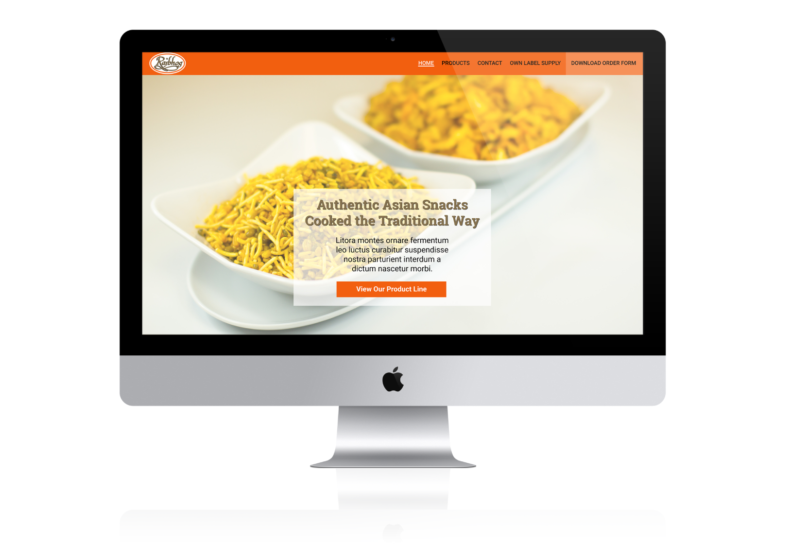
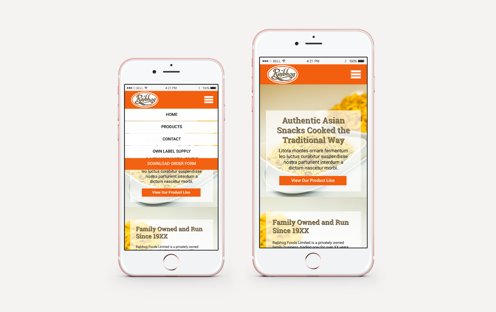

I designed and developed a responsive website for Asian snack manufacturer [Rajbhog Foods](http://www.rajbhogfoods.co.uk/). The website was designed to reflect the client's requests; to advertise current products and services and generate new business leads. Amongst the design and development, I was also responsible for photographing all of the product visuals which appear on the website.

<figure>
  
  <figcaption>
   Rajbhog Foods website design
  </figcaption>
</figure>
<figure>
  
  <figcaption>
   Rajbhog Foods responsive website design on mobile
  </figcaption>
</figure>

