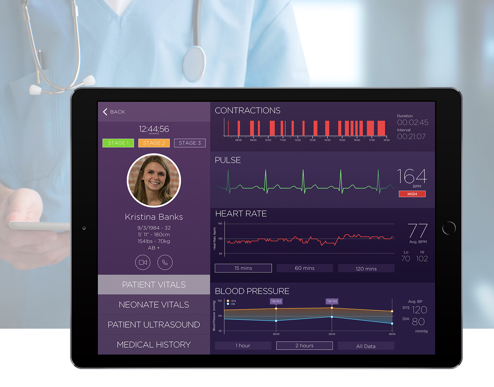
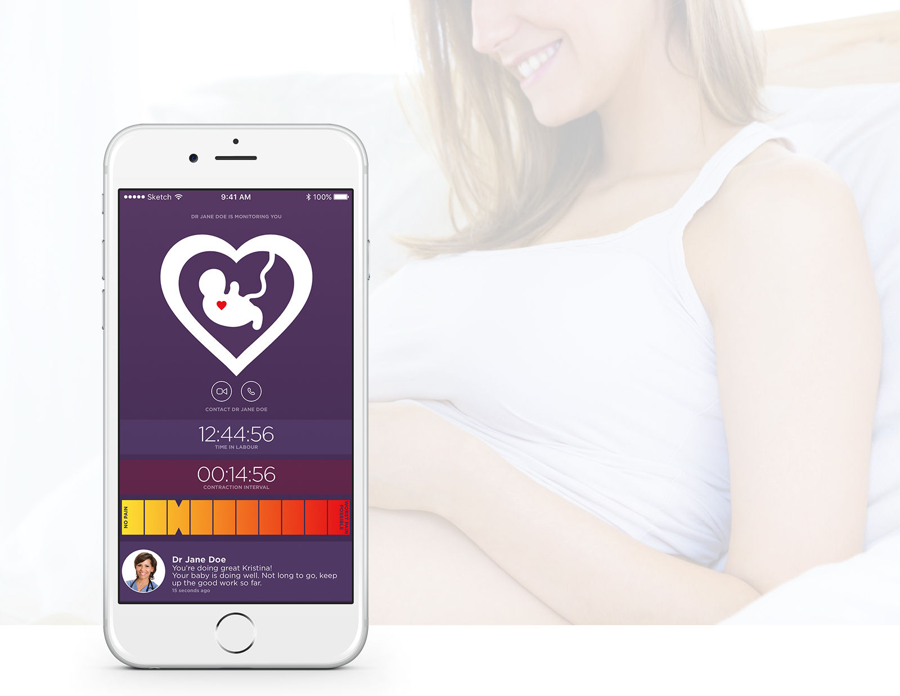

_myMidwife is an on-going conceptual design project based on recent government plans to encourage more women to birth children at home._

A big fear for expectant mothers giving birth outside of a maternity ward is the lack of professional medical oversight to ensure the best outcome for a first time delivery. After speaking with a Doctor of medicine on the topic I was convinced that mobile-technology could play an important role in reducing many of the common concerns, and I felt it was an interesting area to conceptualise.

### ADDRESSING CONCERNS

Before starting on this concept I read through NHS based literature to understand the current hospital procedures for giving birth. I then spent some time interviewing a Doctor who has experience in gynaecology and maternity departments to ensure that the concept would aid in reducing time-consuming processes and eliminate human error where possible.

My next interview was with a friend who has recently given birth for the first time. I spent time understanding her perspective and asking questions about her experiences and first-time concerns. In addition, I spoke with a number of other mothers and expectant mothers (and partners) to further understand the concerns and obstacles that prevent more women from giving birth at home. The interviews proved highly insightful and would ensure that the designs would have a factual basis and strong direction.

### INITIAL DESIGNS

Based on the conversations, it was clear that the requirements for medical staff and patient would be different. The medical professional is more interested in the patient and neonate data, to ensure the smoothest delivery. The patient is most interested in feeling their (and their child's) welfare. The patient instead requires continual reassurance that they are being well looked after and that their child is in good health. After some initial sketches, the designs were transferred to Sketch.

The medical professional would appear more like a dashboard where patient and neonate vitals and medical history were all easy to access. The medical team would be able to monitor a number of expectant mothers from a single device and have the ability to communicate to the patient via video conferencing. In case of emergency, they would have the location information of the patient and would be able to dispatch appropriate services as and where necessary.

As the patient's requirements differ from the medical team, the apps primary purpose would be to reassure patients that they are being frequently monitored. To minimise worry, the app would include little to no medical terminology. The app would predominantly serve as a gateway for connected devices such as a heart rate monitor and baby monitor. This data would be fed back to the medical team in real time for observation. There would be visual representations of select data feeds, including a pulsating babies heart and mothers heart.
